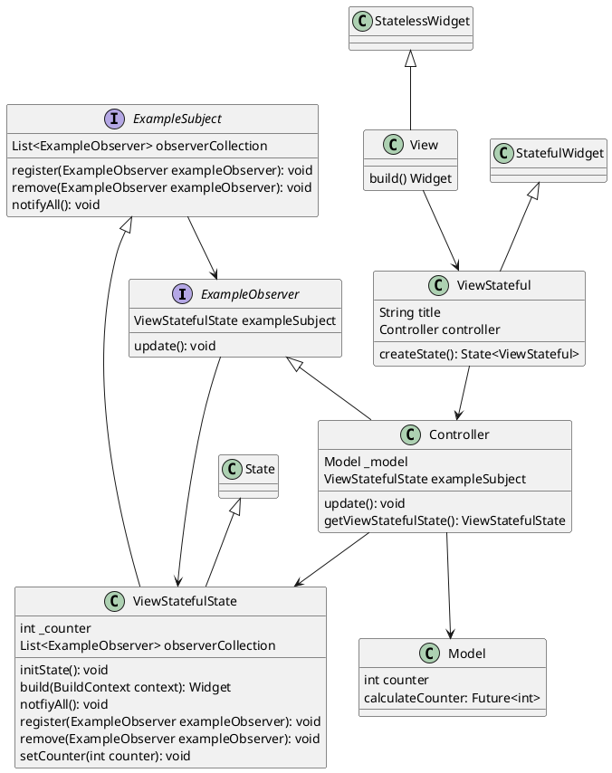

# mvc_example

A MVC example

```plantuml
@startuml
interface ExampleObserver 
ExampleObserver : ViewStatefulState exampleSubject
ExampleObserver : update(): void

interface ExampleSubject
ExampleSubject : List<ExampleObserver> observerCollection
ExampleSubject : register(ExampleObserver exampleObserver): void
ExampleSubject : remove(ExampleObserver exampleObserver): void
ExampleSubject : notifyAll(): void

class Model
Model : int counter
Model : calculateCounter: Future<int>

class Controller
Controller : Model _model
Controller : ViewStatefulState exampleSubject
Controller : update(): void
Controller : getViewStatefulState(): ViewStatefulState

class View 
View : build() Widget

class ViewStateful
ViewStateful : String title
ViewStateful : Controller controller
ViewStateful : createState(): State<ViewStateful>

class ViewStatefulState
ViewStatefulState : int _counter
ViewStatefulState : List<ExampleObserver> observerCollection
ViewStatefulState : initState(): void
ViewStatefulState : build(BuildContext context): Widget
ViewStatefulState : notfiyAll(): void
ViewStatefulState : register(ExampleObserver exampleObserver): void
ViewStatefulState : remove(ExampleObserver exampleObserver): void
ViewStatefulState : setCounter(int counter): void

ViewStateful --> Controller

Controller --> Model
Controller --> ViewStatefulState

View --> ViewStateful

ExampleObserver --> ViewStatefulState

ExampleSubject --> ExampleObserver

State <|-- ViewStatefulState
ExampleSubject <|-- ViewStatefulState
StatefulWidget <|-- ViewStateful
StatelessWidget <|-- View
ExampleObserver <|-- Controller
@enduml
```